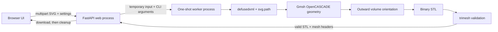

# Development

## Repository layout

```text
app/
  converter.py          SVG parsing, Gmsh geometry, and STL validation
  main.py               FastAPI routes, upload limits, and worker lifecycle
  worker.py             One-shot conversion subprocess entry point
  static/               Browser JavaScript, CSS, and local Three.js modules
  templates/            Jinja2 application page
examples/
  simple_shapes.svg     Neutral regression and demonstration input
tests/
  test_converter.py     Geometry and validation tests
  test_web.py           HTTP and upload tests
docs/                   Markdown guides and the static GitHub Pages website
compose.yaml            Hardened single-service deployment
Dockerfile              Production image
```

## Architecture



Gmsh uses process-global state. Running each conversion in a separate worker
prevents state from leaking between uploads and gives the web process a hard
timeout boundary. The FastAPI process uses a semaphore to limit how many Gmsh
workers run concurrently.

The source SVG is previewed as a blob-backed image rather than inserted into
the document. The STL returned by the conversion endpoint is also retained as
a browser blob and parsed locally for the optional Three.js preview; it is not
sent to another endpoint. Three.js, STLLoader, and OrbitControls are pinned and
served from `app/static`, so the interface has no CDN or internet dependency.

## Conversion pipeline

1. Parse the SVG as XML with external entities disabled.
2. Read non-empty `<path d="...">` attributes.
3. Keep contours that contain an explicit close segment.
4. Preserve exact line endpoints and sample curves according to `definition`.
5. Remove a repeated closing point to avoid a zero-length Gmsh edge.
6. Scale every contour by one factor so the requested artwork height is met.
7. Build either a plate-with-holes surface or one surface per SVG contour.
8. Extrude the surfaces along Z using OpenCASCADE.
9. Generate the volume mesh and orient each volume boundary outward.
10. Write a binary STL and reload it through trimesh.
11. Return the file only when the complete printability contract passes.

## Why outward orientation matters

An STL triangle's vertex order defines its normal. A mesh can use every edge
twice and still contain faces pointing toward the interior. Some slicers then
misidentify inside and outside, which can remove material or fill intended
openings.

The converter calls `gmsh.model.mesh.setOutwardOrientation` for every generated
volume. It then independently verifies consistent winding and positive volume
with trimesh. A regression test reverses one face of a known box and confirms
that validation rejects it.

## Local setup

Python 3.11 or newer is supported. Windows PowerShell:

```powershell
python -m venv .venv
.\.venv\Scripts\python -m pip install --upgrade pip
.\.venv\Scripts\python -m pip install -r requirements.txt
.\.venv\Scripts\python -m uvicorn app.main:app --reload --port 8080
```

Linux may require the same libraries installed by the Dockerfile:

```bash
sudo apt-get update
sudo apt-get install -y libglu1-mesa libgomp1
python3 -m venv .venv
.venv/bin/python -m pip install --upgrade pip
.venv/bin/python -m pip install -r requirements.txt
.venv/bin/python -m uvicorn app.main:app --reload --port 8080
```

## Checks

Run the complete local check set before pushing:

```powershell
.\.venv\Scripts\python -m ruff check .
.\.venv\Scripts\python -m ruff format --check .
.\.venv\Scripts\python -m pytest
.\.venv\Scripts\python -m pip check
.\.venv\Scripts\python -m pip install ".[audit]"
.\.venv\Scripts\python -m pip_audit --strict --progress-spinner off .
```

The geometry tests perform real Gmsh conversions. They are slower than ordinary
unit tests by design because they verify the final STL contract.

GitHub Actions repeats linting and tests on Linux, builds the Docker image, and
runs a separate blocking audit of the Python runtime dependency tree against
known vulnerabilities. Dependabot checks Python, GitHub Actions, and Docker
dependencies every Monday and proposes updates as pull requests.

The separate Pages workflow publishes the dependency-free files in `docs/`.
The landing page uses real application screenshots, and `manual.html` renders
the Markdown guides in the site itself. Preview the directory with any static
file server; it does not require the Python application or conversion
dependencies.

## Python API

The converter can be called without the web layer:

```python
from app.converter import convert_svg_to_stl

report = convert_svg_to_stl(
    "examples/simple_shapes.svg",
    "simple_shapes_shape.stl",
    output_mode="shape",
    height_mm=80,
    thickness_mm=3,
    border_mm=10,
    definition=12,
)

print(report.printable, report.extents)
```

Valid `output_mode` values are `stencil` and `shape`. The returned `MeshReport`
contains the measurements and topology checks described in the
[API reference](API.md#validation-headers).

## Adding conversion behavior

Keep changes in sympathy with the existing boundaries:

- SVG interpretation and mesh behavior belong in `converter.py`.
- Process isolation belongs in `worker.py`.
- upload, limits, errors, and response headers belong in `main.py`.
- every geometry change needs a real STL regression test;
- do not weaken validation to accept a newly generated mesh;
- update the usage limitations whenever SVG interpretation changes.

The public web API is intentionally small. When adding a setting, update the
HTML form, JavaScript state, FastAPI validation, worker CLI, converter call,
tests, and `docs/API.md` together.

